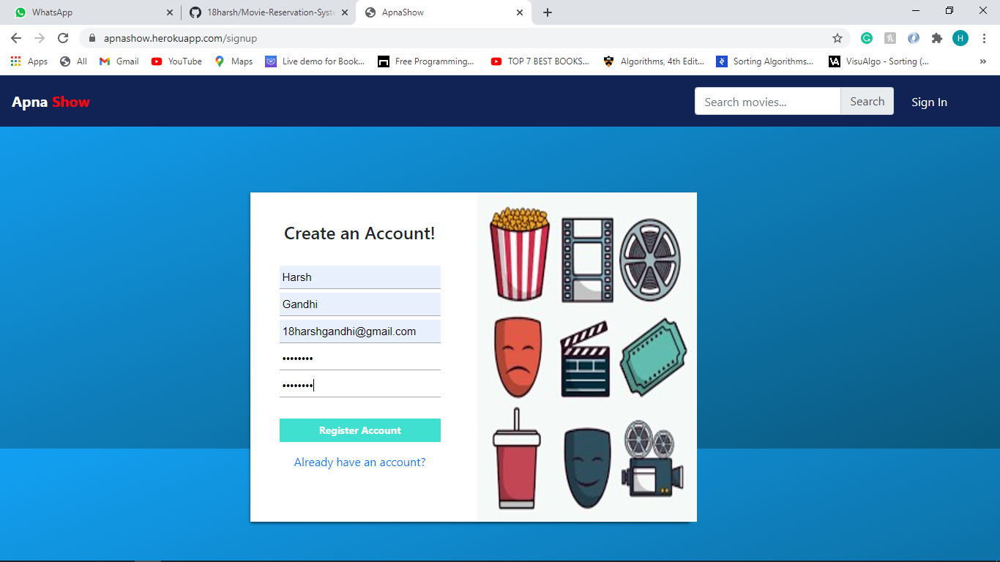
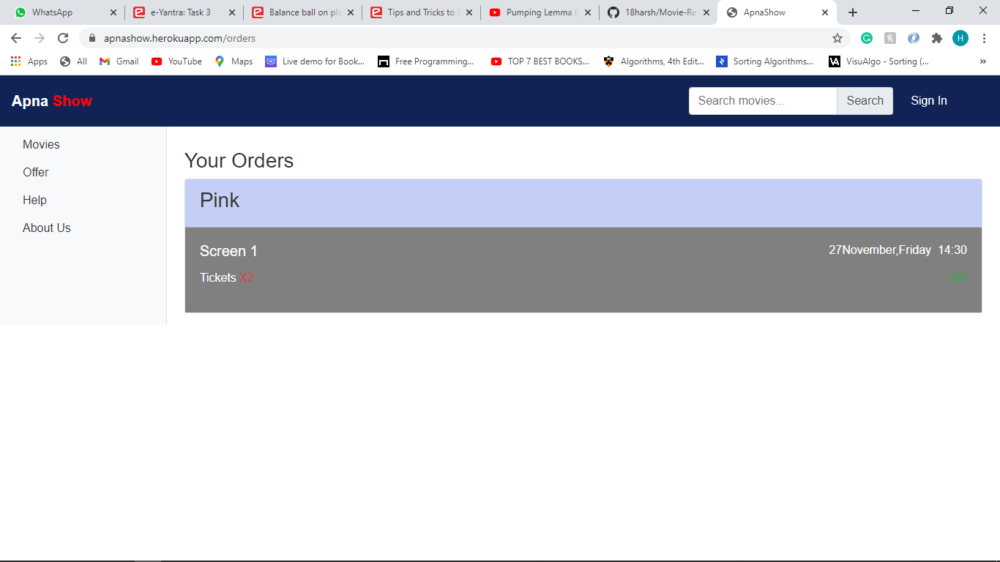

# Movie-Reservation-System
Online movie ticket reservation system is basically made for providing the customer’s, any where and anytime service for booking seat in movie hall and together. Information about the movies online. The user can easily be able to know about the movies released and then make choice.

# Check the website live on
https://apnashow.herokuapp.com/

# Images

<h2>FrontEnd</h2>

<h3>Sign Up Page</h3>

<h3>Sign In Page</h3>

<h3>Home Page</h3>

<h3>Offer Page</h3>

<h3>FAQ Page</h3>

<h3>Filter Page</h3>

<h3>Select Movie Time</h3>

<h3>Select Seats</h3>

<h3>Ticket Bill</h3>

<h3>Payment option</h3>

  
<h3>Card Detail</h3>

<h3>Card Pin</h3>

<h3>Successful Payment</h3>

<h3>Your Orders</h3>

<h2>BackEnd</h2>
<h3><a href="https://github.com/18harsh/Movie-Reservation-System/blob/master/src/app.js">Node Js code</a></h3>

<h2>Database (MongoDB)</h2>

<h3>Movie Data</h3>

<h3>User Data</h3>

